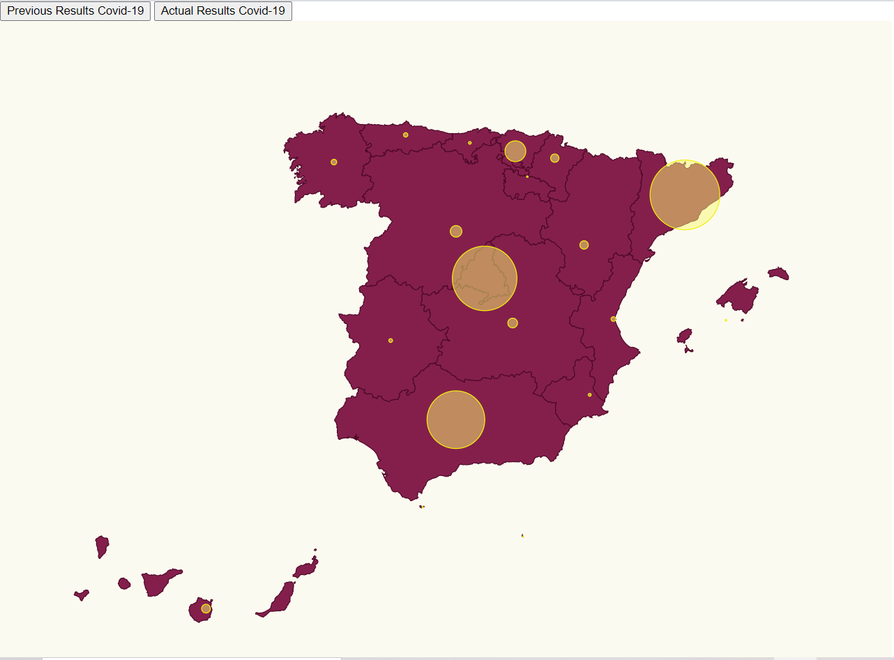

# Multiple Series

In this challenge we want to obtain something like this:




# Steps

- We will take as starting example _02-pin-location-scale, let's copy the content from that folder and execute _npm install_.

```bash
npm install
```

- Let's add two buttons in the _index.html_ file:

_./src/index.html_

```diff
  <body>
    <div>
+      <button id="Previous">Results Previous</button>
+      <button id="Actual">Results Actual</button>
    </div>
    <script src="./index.ts"></script>
  </body>
```

- Let's import the data of the actual number of people infected in one day (data collected on 12/04/2021):
- Wep page: https://www.eldiario.es/sociedad/mapa-datos-coronavirus-espana-comunidades-autonomas-abril-9_1_1039633.html

_./src/index.ts_

```diff
import * as d3 from "d3";
import { 
  statsPrevious, 
  statsActual, 
  ResultEntry } from "./stats";
```

- In actual covid-19 data we will add information about some communities more: Ceuta, Melilla and Navarra that were missing in the previous data of covid-19 infections.
- It was necessary to add the latitude and longitude for Ceuta and Melilla in communities.ts file.

_./src/communities.ts_
```typescript
  {
    name: "Ceuta",
    long: -5.3162,
    lat: 35.8883,
  },
  {
    name: "Melilla",
    long: -2.93848,
    lat: 35.2919,
  },
```

- In this case the maximum number of affected people of all communities will vary in function of the previous or actual data, that is why we define this maximum as a function depending on the date stat:

_./src/index.ts_

```typescript
const maxAffected = (stats: ResultEntry[]) => {
  return stats.reduce(
  (max, item) => (item.value > max ? item.value : max), 0)
};
```
- Instead of creating a scale map affected to radius size we will calculate the size of the circle directly in the function calculateRaiusOnAffectedCases. What we return is the division between the number of cases in a community and the maximum number of cases of all the comunities (maxAffected) and multiply it by 40 pixels:

_./src/index.ts_

```typescript
const calculateRadiusBasedOnAffectedCases = (
  comunidad: string,
  stats: ResultEntry[]
) => {
  var max = <number>maxAffected(stats);
  const entry = stats.find((item) => item.name === comunidad);
  
  return entry ? (entry.value/max)*40 : 0;
}
```

- I have changed the map color and the circles' color and transparency:

_./src/map.css_

```diff
.country {
  stroke-width: 1;
  stroke: #4f0828;
  fill: #841f4c;
}

.affected-marker {
  stroke-width: 1;
  stroke: #f1f10a;
  fill: #F9F871;
  fill-opacity: 0.5;
}
```

- Let's add a method to swap the data we are using (e.g. swap Actual results with the last results in 2021),
  we will append all this code at the end of the index.ts file:

_./src/index.ts_

```typescript
const updateChart = (stat: ResultEntry[]) => {
  console.log("updating")
  svg.selectAll("circle").remove();
  return svg
    .selectAll("circle")
    .data(latLongCommunities)
    .enter()
    .append("circle")
    .attr("class", "affected-marker")
    .attr("r", (d) => calculateRadiusBasedOnAffectedCases(d.name, stat))
    .attr("cx", (d) => aProjection([d.long, d.lat])[0])
    .attr("cy", (d) => aProjection([d.long, d.lat])[1]);
};
```

- And now call them on each button with the corresponding data:

```typescript
// Buttons and changing data series
document
  .getElementById("Previous")
  .addEventListener("click", function handleResults() {
    updateChart(statsPrevious);
  });

document
  .getElementById("Actual")
  .addEventListener("click", function handleResults() {
    updateChart(statsActual);
  });
```
