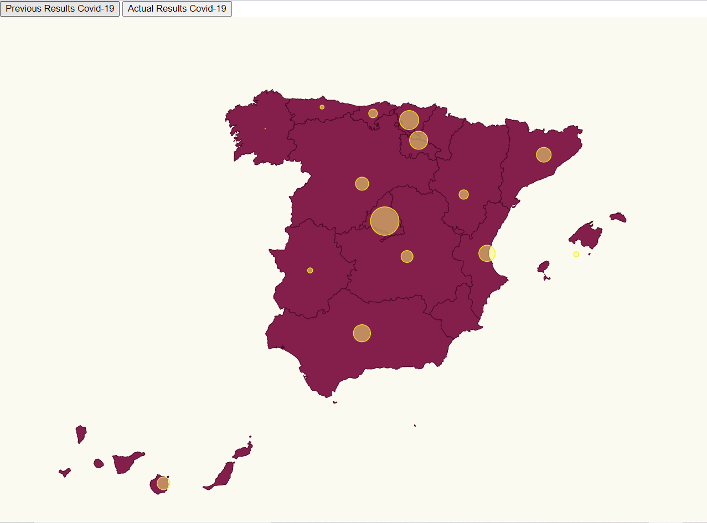

# Multiple Series

In this challenge we want to obtain something like this:




# Steps

- We will take as starting example _02-pin-location-scale_, let's copy the content from that folder and execute _npm install_.

```bash
npm install
```

- Let's add two buttons in the _index.html_ file:

_./src/index.html_

```diff
  <body>
    <div>
+      <button id="Previous">Results Previous</button>
+      <button id="Actual">Results Actual</button>
    </div>
    <script src="./index.ts"></script>
  </body>
```

- Let's import the data of the actual number of people infected in one day (data collected on 12/04/2021):
- Wep page: https://www.eldiario.es/sociedad/mapa-datos-coronavirus-espana-comunidades-autonomas-abril-9_1_1039633.html

_./src/index.ts_

```diff
import * as d3 from "d3";
import { 
  statsPrevious, 
  statsActual, 
  ResultEntry } from "./stats";
```

- In actual covid-19 data we will add information about some communities more: Ceuta, Melilla and Navarra that were missing in the previous data of covid-19 infections.
- It was necessary to add the latitude and longitude for Ceuta and Melilla in communities.ts file.

_./src/communities.ts_
```typescript
  {
    name: "Ceuta",
    long: -5.3162,
    lat: 35.8883,
  },
  {
    name: "Melilla",
    long: -2.93848,
    lat: 35.2919,
  },
```

- If we compare the cases of covid-19 in principles of 2020 with the cases in one day in April 2021 the difference is enormous, previously the cases round between [0,174] infections daily and actually the cases round between [39,2626] infections daily, that is why it will be necessary to scale the data.
- In this case, I will use the same maxAffected function which calculates the maximum of cases in the previous stats. The function affectedRadiusScale returns a radius in function of the given value of infections, but if we insert for example the incidents of Madrid on 12th April 2021 the circle is enormous, that is why after calculating this radius we will apply the logarithmic function, we will obtain a number bigger than 0 and probably lower than 3, so we multiply this number per 5 pixels. I have also decided to sum later 1 pixel because in the case of Galicia (3 infections) the circle was not appreciable at sight.

_./src/index.ts_

```typescript
const calculateRadiusBasedOnAffectedCases = (
  comunidad: string,
  dataset: ResultEntry[]
) => {
  const entry = dataset.find((item) => item.name === comunidad);

  // It is necessary to scale the numbers because they differ a lot from the previous and the actuals
  return entry ? Math.log(affectedRadiusScale(entry.value))*5 + 1 : 0;
};
```

- I have changed the map color and the circles' color and transparency:

_./src/map.css_

```diff
.country {
  stroke-width: 1;
  stroke: #4f0828;
  fill: #841f4c;
}

.affected-marker {
  stroke-width: 1;
  stroke: #f1f10a;
  fill: #F9F871;
  fill-opacity: 0.5;
}
```

- Let's add a method to swap the data we are using (e.g. swap Actual results with the last results in 2021),
  we will append all this code at the end of the index.ts file:

_./src/index.ts_

```typescript
const updateChart = (stat: ResultEntry[]) => {
  console.log("updating")
  svg.selectAll("circle").remove();
  return svg
    .selectAll("circle")
    .data(latLongCommunities)
    .enter()
    .append("circle")
    .attr("class", "affected-marker")
    .attr("r", (d) => calculateRadiusBasedOnAffectedCases(d.name, stat))
    .attr("cx", (d) => aProjection([d.long, d.lat])[0])
    .attr("cy", (d) => aProjection([d.long, d.lat])[1]);
};
```

- And now call them on each button with the corresponding data:

```typescript
// Buttons and changing data series
document
  .getElementById("Previous")
  .addEventListener("click", function handleResults() {
    updateChart(statsPrevious);
  });

document
  .getElementById("Actual")
  .addEventListener("click", function handleResults() {
    updateChart(statsActual);
  });
```
